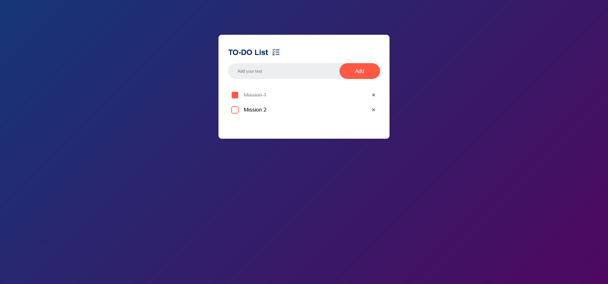

# TO-DO List 📝

This is a simple and elegant TO-DO list application built using HTML5, CSS3, and JavaScript. It allows users to add tasks, mark them as completed, and remove them. The data is stored in the browser's `localStorage`, so the list persists even after refreshing the page.

## Preview



## Features:
- **Add Task**: Users can add a task by typing in the input box and clicking the "Add" button.
- **Mark as Completed**: Users can click on a task to mark it as completed (strikethrough effect).
- **Delete Task**: Users can remove tasks by clicking the "×" icon next to the task.
- **Data Persistence**: Tasks are saved in the browser's `localStorage`, so the list remains after the page is refreshed.

## Technologies Used:
- HTML5
- CSS3
- JavaScript (ES6)
- `localStorage` for saving tasks

## How to Use:
1. Enter a task in the input field.
2. Click the **Add** button to add the task to the list.
3. Click on a task to mark it as completed.
4. Click the "×" icon to delete a task.
5. Your tasks will remain in the list even after refreshing the page thanks to `localStorage`.

## Project Structure:
```bash
.
├── index.html      # The main HTML file
├── style.css       # The main CSS file for styling the app
└── script.js       # The main JavaScript file for app functionality
